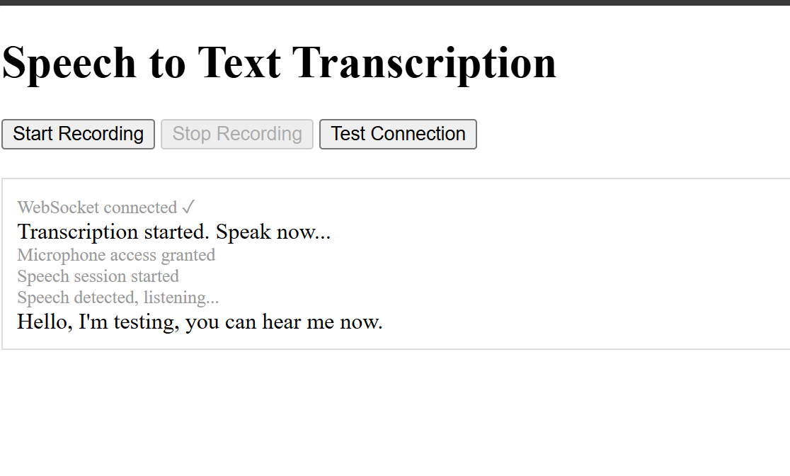

# Speech-to-Text Python Web App

Sample for a simple speech-to-text Python web app for hosting on App Service.

This sample demonstrates how to create a web application that uses Azure's Speech Service to convert speech to text. The app is built using Flask and can be deployed on Azure App Service leveraging web sockets for real-time audio streaming.



## Setup Instructions

### 1. Create an Azure Speech Service

1. Go to the [Azure Portal](https://portal.azure.com/).
2. Create a new Speech Service resource.
3. Note down the `Subscription Key` and `Service Region`.

### 2. Create an Azure App Service
1. In the Azure Portal, create a new App Service by clicking on "Create a resource" and selecting "Web App".
2. Choose the following settings:
   - **Subscription**: Your Azure subscription.
   - **Resource Group**: Create a new resource group or use an existing one.
   - **Name**: A unique name for your app.
   - **Publish**: Code.
   - **Runtime stack**: Python 3.9.
   - **Operating System**: Linux.
   - **Region**: Choose a region close to you.


### 3. Set Environment Variables

Set the following environment variables in your App Service's Application Settings:

1. In the Azure Portal, navigate to your App Service.
2. Under "Settings", select "Configuration".
3. Click on "New application setting" and add the following keys and values:
- `AZURE_SPEECH_KEY`: Your Azure Speech Service subscription key.
- `AZURE_SERVICE_REGION`: Your Azure Speech Service region.

### 4. Configure App Service

1. In the Azure Portal, navigate to your App Service.
2. Under "Settings", select "Configuration" and then "General settings".
4. Set the startup command in the app service general settings to:

   ```
   gunicorn --bind=0.0.0.0:8000 --worker-class=geventwebsocket.gunicorn.workers.GeventWebSocketWorker --timeout=600 app:app
   ```

### 5. Deploying to Azure App Service using VS Code
1. Clone this repository to your local machine.
2. Open the cloned repository in Visual Studio Code and install the Azure App Service extension if you haven't already.
3. Sign in to your Azure account in Visual Studio Code.
4. In the Azure App Service extension, right-click on your App Service and select "Deploy to Web App".
5. Select the folder containing your app code.
6. Confirm the deployment when prompted.
7. Wait for the deployment to complete. You can monitor the output in the terminal.

### 6. Testing the App
1. Open your web browser and navigate to the URL of your deployed App Service.
2. You should see the web app interface.

    

3. Click on the "Start Recording" button to begin recording your speech.
4. Speak into your microphone and click "Stop Recording" when
    you're done.


### 7. Running Locally

To run the app locally, create a virtual environment and use the following command:
1. Create a virtual environment:
    ```bash
    python -m venv venv
    ```
2. Activate the virtual environment:

    Bash

    ```bash
    source venv/bin/activate
    ```

    Powershell

    ```powershell
    venv\Scripts\activate
    ```

2. Install the required packages:
    ```bash
    pip install -r requirements.txt
    ```

3. Set the environment variables in your local environment:

    Bash

    ```bash
    export AZURE_SPEECH_KEY=your_speech_key
    export AZURE_SERVICE_REGION=your_service_region
    ```

    Powershell

    ```Powershell
    $env:AZURE_SPEECH_KEY = "your_speech_key"
    $env:AZURE_SERVICE_REGION = "your_service_region"
    ```

4. Run the app:
    ```bash
    python app.py
    ```
5. Open your browser and navigate to `http://localhost:5000` to access the app.


